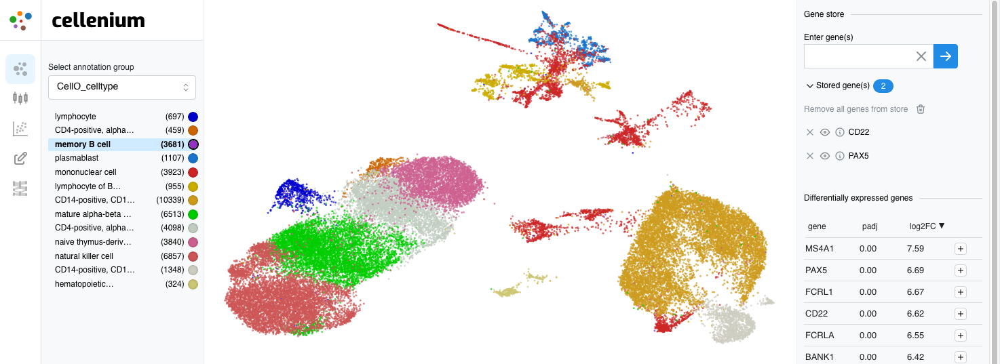

# cellenium

Cellenium is a FAIR and scalable interactive visual analytics app for scRNA-Seq data. It allows to:
* organize and semantically find scRNA studies with ontologized metadata for tissues and diseases
* explore cell types and other cell annotations in UMAP space
* find differentially expressed genes based on clusters of annotated cells
* view the expression of a single gene (or a few selected genes) in the UMAP plot or as grouped violin plots
* draw coexpression plots for pairs of genes, explore the cell types contained in the plots
* add new cell annotations based on plot selections, see differentially expressed genes for a selected group of cells
* find genes which expression is highly correlated to a query gene
* find marker genes in all imported studies and qualitatively compare gene expression across studies 

Link to publication: ...



## System Overview

Cellenium imports scRNA expression data and cell annotations in H5AD format. We provide jupyter notebooks for
downloading some publicly available scRNA studies, normalize the data if necessary, and calculate differentially
expressed genes, a UMAP projection and other study data that is needed for Cellenium's features to work.

Cellenium is a web application that accesses a PostgreSQL database via GraphQL API. Some API features, like
server-side rendered plots, depend on Python stored procedures. The [graphql_api_usage](graphql_api_usage/) folder
contains a couple of example queries to illustrate the API capabilities.

The setup steps below automate the download and creation of appropriate H5AD files, docker image build,
database schema setup and data ingestion.

## Setting up

Preparation of CellO data files (workaround for https://github.com/deweylab/CellO/issues/29 ):

```bash
mkdir scratch/cello_resources
curl https://deweylab.biostat.wisc.edu/cell_type_classification/resources_v2.0.0.tar.gz >scratch/cello_resources/resources_v2.0.0.tar.gz
tar -C scratch/cello_resources -zxf scratch/cello_resources/resources_v2.0.0.tar.gz
```

Cellenium setup, including execution of study data processing notebooks (initially, this will take a couple of hours
to run).

```bash
docker-compose up
conda env create -f data_import/environment.yml
conda activate cellenium_import
# 'test_studydata' should contain data to cover all application features, but is small enough to be imported in a few minutes
make reset_database test_studydata_import
# 'normal_studydata': real life studies (i.e. with full amount of cells and genes)
make normal_studydata_import
```

Before you process and import the huge example study (there are two additional make targets for that), edit the beginning
of `heart_failure_reichart2022*.ipynb` and define the download URL as described in the notebooks.

## manually executing the study data preparation jupyter notebooks

The notebooks are run in headless mode by `make`. To create new notebooks and explore datasets:

```bash
(cd data_import && PYTHONPATH=$(pwd) jupyter-lab)
```
